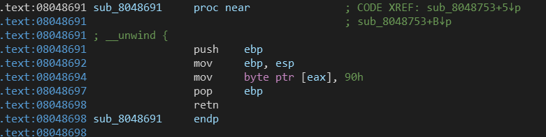
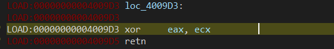

### 第五空间

#### Re

##### nop

找到`main`函数，输入一个整数，把反调试patch掉，发现输入的数据经过`+1 +1 +0xcccccccc +1`之后，来到这里


`sub_8048691`如图



上面把输入的值传入到`eax`中，然后把该地址处的值`patch`成`nop`，`patch`两位，然后继续运行


第一个`jmp`会跳转到第二个`jmp`的位置，然后直接跳转输出`wrong`，联想到上面的`patch`操作，需要把第二个`jmp`给`patch`掉

所以只需要计算`input+1+1+0xcccccccc+1=0x8048765`，得到输入为`993507990`

最终的`flag`

```
flag{993507990}
```

##### rev

程序流程很奇怪，调试一下

首先读取输入


然后索引`+1`，可以看到是每四位取一个，从索引值为4的元素开始取（整个flag的格式为`ctf{***}`，前四位是已知的)，取出来一组4个利用`r9`来检索

接下来对这四个数进行处理，其中的运算很多但是有一些是没有用的，主要进行的运算是异或，不妨用`r9[4]`来表示这四个数组成的数组


首先取出`r9[i]`


此时`esi`里是`2*r9[i]`


`ecx=esi=2*r9[i]`


这三条指令实际取出的是`r9[(i+1)%4]`


`eax=2*ecx=2*r9[(i+1)%4]`


`eax=2*r9[(i+1)%4]^r9[(i+1)%4]`


此时`ecx=(i+2)%4,ebx=(i+3)%4`


`ecx=r9[(i+2)%4]`


`ecx=r9[(i+3)%4]^r9[(1+2)%4]`


`ecx=(2*r9[i])^r9[(i+3)%4]^r9[(1+2)%4]`



`eax=(2*r9[i])^r9[(i+3)%4]^r9[(1+2)%4]^(2*r9[(i+1)%4])^r9[(i+1)%4]`


写入原位置，对于每一个数据都这样执行一遍，共取出4组这样的数据

运算出的结果四组依次取出，顺序排放，然后异或当前位置的索引值，和内存中的已有数据进行对比，全部相同则正确，最后验证格式是否为`ctf{***}`

虽然运算只有异或，但是涉及到了四个数字，不是很好逆向运算，所以选择爆破

```python
target = [0x64, 0x25, 0x0F, 0x6C, 0x20, 0x23, 0x8A, 0xDE, 0x10, 0x0E, 0xA5, 0xE1, 0x43, 0x37, 0x11, 0x53]
for i, c in enumerate(target):
    c ^= i
    target[i] = c

# target = [100, 36, 13, 111, 36, 38, 140, 217, 24, 7, 175, 234, 79, 58, 31, 92]

for a in range(32, 128):
    for b in range(32, 128):
        for c in range(32, 128):
            for d in range(32, 128):
                x = (2 * a) ^ (2 * b) ^ b ^ c ^ d
                y = (2 * b) ^ (2 * c) ^ c ^ d ^ a
                z = (2 * c) ^ (2 * d) ^ d ^ a ^ b
                w = (2 * d) ^ (2 * a) ^ a ^ b ^ c
                if x == target[0] and y == target[1] and z == target[2] and w == target[3]:
                    print(a, b, c, d)
                    break

for a in range(32, 128):
    for b in range(32, 128):
        for c in range(32, 128):
            for d in range(32, 128):
                x = (2 * a) ^ (2 * b) ^ b ^ c ^ d
                y = (2 * b) ^ (2 * c) ^ c ^ d ^ a
                z = (2 * c) ^ (2 * d) ^ d ^ a ^ b
                w = (2 * d) ^ (2 * a) ^ a ^ b ^ c
                if x == target[4] and y == target[5] and z == target[6] and w == target[7]:
                    print(a, b, c, d)
                    break

for a in range(32, 128):
    for b in range(32, 128):
        for c in range(32, 128):
            for d in range(32, 128):
                x = (2 * a) ^ (2 * b) ^ b ^ c ^ d
                y = (2 * b) ^ (2 * c) ^ c ^ d ^ a
                z = (2 * c) ^ (2 * d) ^ d ^ a ^ b
                w = (2 * d) ^ (2 * a) ^ a ^ b ^ c
                if x == target[8] and y == target[9] and z == target[10] and w == target[11]:
                    print(a, b, c, d)
                    break
 
for a in range(32, 128):
    for b in range(32, 128):
        for c in range(32, 128):
            for d in range(32, 128):
                x = (2 * a) ^ (2 * b) ^ b ^ c ^ d
                y = (2 * b) ^ (2 * c) ^ c ^ d ^ a
                z = (2 * c) ^ (2 * d) ^ d ^ a ^ b
                w = (2 * d) ^ (2 * a) ^ a ^ b ^ c
                if x == target[12] and y == target[13] and z == target[14] and w == target[15]:
                    print(a, b, c, d)
                    break

# print(chr(114) + chr(104) + chr(95) + chr(103))
# print(chr(111) + chr(97) + chr(105) + chr(48))
# print(chr(112) + chr(105) + chr(115) + chr(48))
# print(chr(99) + chr(110) + chr(95) + chr(100))
```

转成字符

```
rh_g
oai0
pis0
cn_d
```

调整一下顺序，套进格式里

```
ctf{ropchain_is_g00d}
```


#### Crypto

##### rosb

同样的n，根据两个不同的e算出了不同的密文，典型的共模攻击

```python
import sys
import binascii

sys.setrecursionlimit(1000000)


def egcd(a, b):
    if a == 0:
        return (b, 0, 1)
    else:
        g, y, x = egcd(b % a, a)
        return (g, x - (b // a) * y, y)


def modinv(a, m):
    g, x, y = egcd(a, m)
    if g != 1:
        raise Exception('modular inverse does not exist')
    else:
        return x % m


n = 0xa1d4d377001f1b8d5b2740514ce699b49dc8a02f12df9a960e80e2a6ee13b7a97d9f508721e3dd7a6842c24ab25ab87d1132358de7c6c4cee3fb3ec9b7fd873626bd0251d16912de1f0f1a2bba52b082339113ad1a262121db31db9ee1bf9f26023182acce8f84612bfeb075803cf610f27b7b16147f7d29cc3fd463df7ea31ca860d59aae5506479c76206603de54044e7b778e21082c4c4da795d39dc2b9c0589e577a773133c89fa8e3a4bd047b8e7d6da0d9a0d8a3c1a3607ce983deb350e1c649725cccb0e9d756fc3107dd4352aa18c45a65bab7772a4c5aef7020a1e67e6085cc125d9fc042d96489a08d885f448ece8f7f254067dfff0c4e72a63557
e1 = 0xf4c1158f
c1 = 0x2f6546062ff19fe6a3155d76ef90410a3cbc07fef5dff8d3d5964174dfcaf9daa003967a29c516657044e87c1cbbf2dba2e158452ca8b7adba5e635915d2925ac4f76312feb3b0c85c3b8722c0e4aedeaec2f2037cc5f676f99b7260c3f83ffbaba86cda0f6a9cd4c70b37296e8f36c3ceaae15b5bf0b290119592ff03427b80055f08c394e5aa6c45bd634c80c59a9f70a92dc70eebec15d4a5e256bf78775e0d3d14f3a0103d9ad8ea6257a0384091f14da59e52581ba2e8ad3adb9747435e9283e8064de21ac41ab2c7b161a3c072b7841d4a594a8b348a923d4cc39f02e05ce95a69c7500c29f6bb415c11e4e0cdb410d0ec2644d6243db38e893c8a3707
c2 = 0xd32dfad68d790022758d155f2d8bf46bb762ae5cc17281f2f3a8794575ec684819690b22106c1cdaea06abaf7d0dbf841ebd152be51528338d1da8a78f666e0da85367ee8c1e6addbf590fc15f1b2182972dcbe4bbe8ad359b7d15febd5597f5a87fa4c6c51ac4021af60aeb726a3dc7689daed70144db57d1913a4dc29a2b2ec34c99c507d0856d6bf5d5d01ee514d47c7477a7fb8a6747337e7caf2d6537183c20e14c7b79380d9f7bcd7cda9e3bfb00c2b57822663c9a5a24927bceec316c8ffc59ab3bfc19f364033da038a4fb3ecef3b4cb299f4b600f76b8a518b25b576f745412fe53d229e77e68380397eee6ffbc36f6cc734815cd4065dc73dcbcb
e2 = 0xf493f7d1

s = egcd(e1, e2)
s1 = s[1]
s2 = s[2]

if s1 < 0:
    s1 = - s1
    c1 = modinv(c1, n)
elif s2 < 0:
    s2 = - s2
    c2 = modinv(c2, n)
m = (pow(c1, s1, n) * pow(c2, s2, n)) % n
# print(m)
print(binascii.unhexlify(hex(m)[2:].strip("L")))
```

输出

```
b'g0od_go0d_stu4y_d4yd4y_Up-M\x13\xe2_%\xbfQ3\xff:<\xd3P\xbb\x11\xf5\xf7b\x84\x14\x042\xa7\xeb\x02\xdam!\x9f^\xd2\x0f\x00\x9b\xbc+;\t<\xcd\xe6\x82\xe5\x88\xb5\x90\x15\xb8m\xbcc\xa0\xe9\x96\x12\xf7\xc1\xc59\xc2d\xb4)'
```

后面是生成的随机数，前面为flag

```
flag{g0od_go0d_stu4y_d4yd4y_Up}
```

