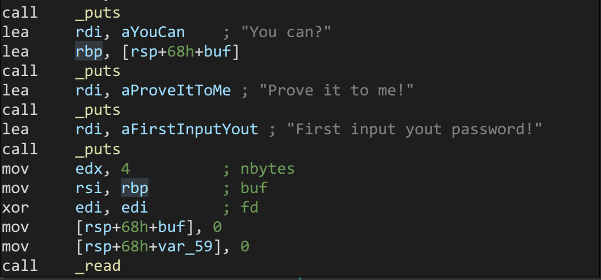
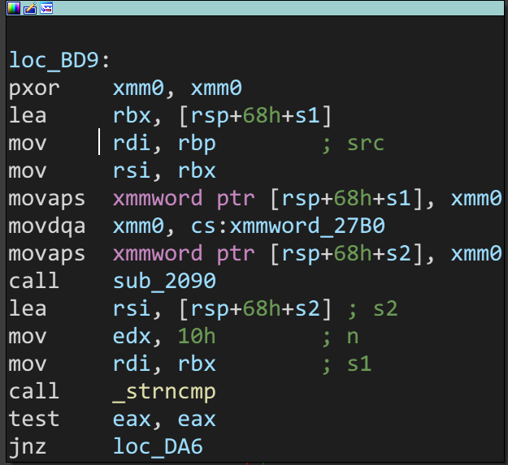
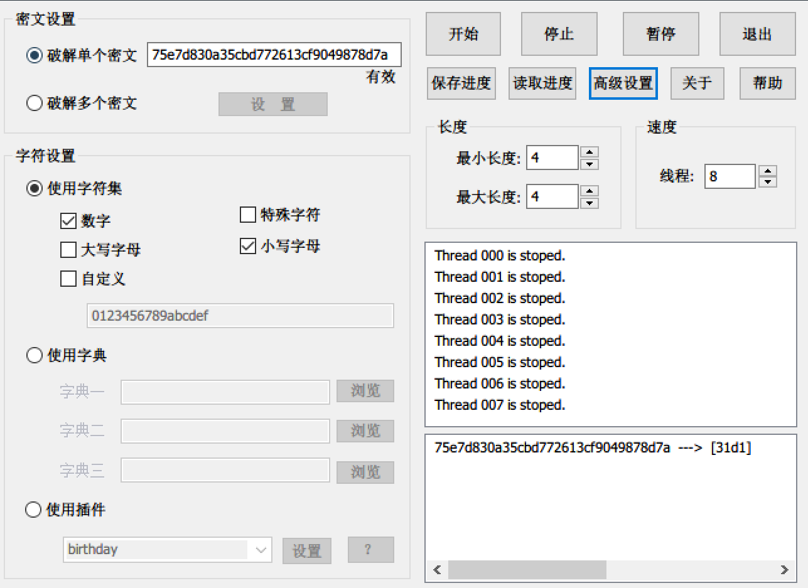
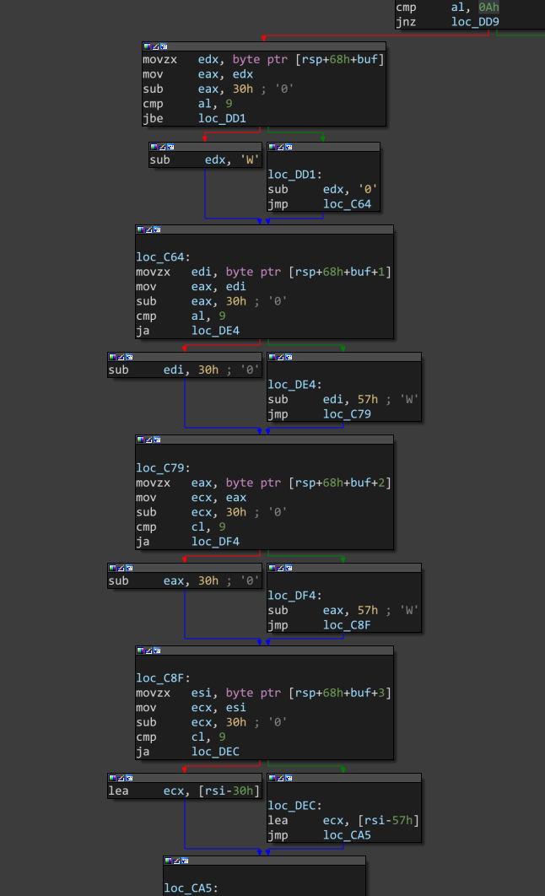
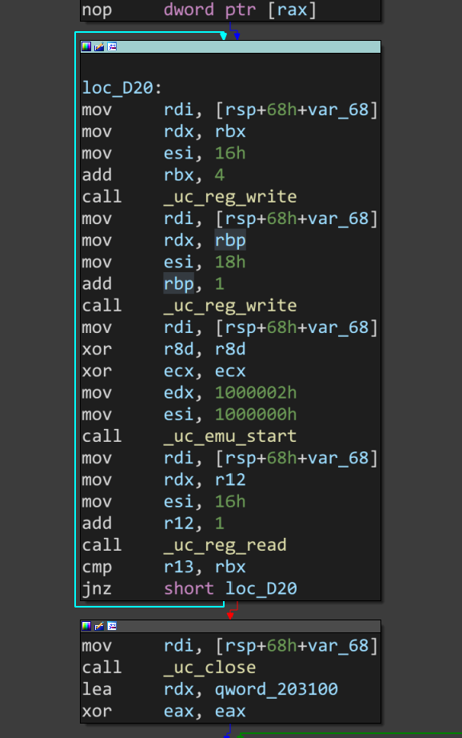
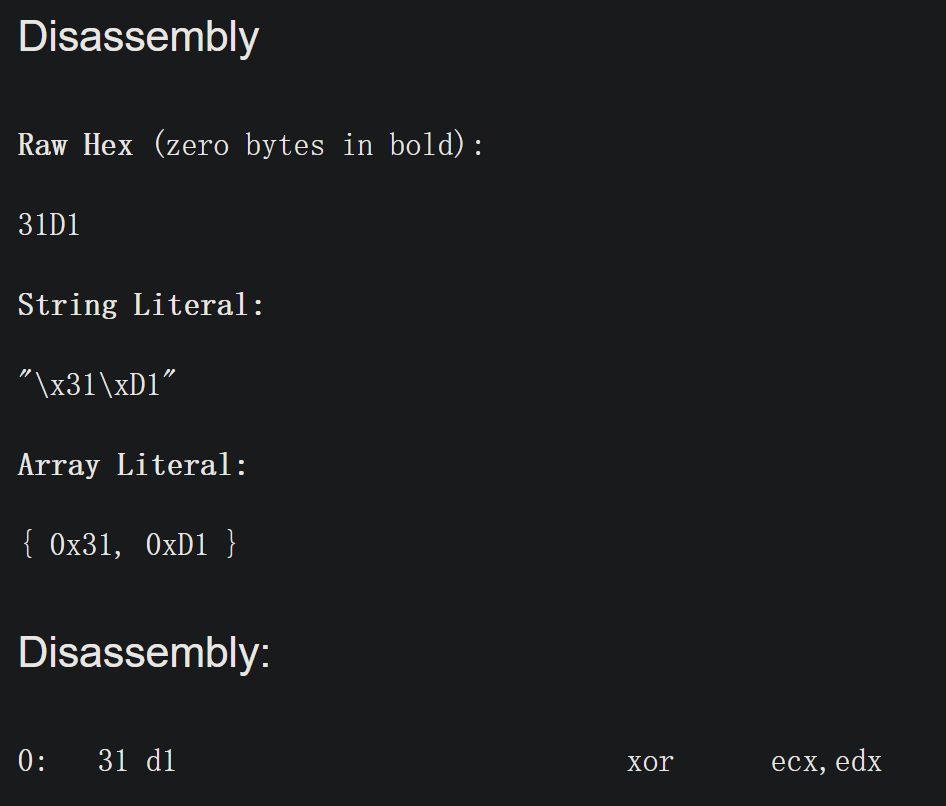
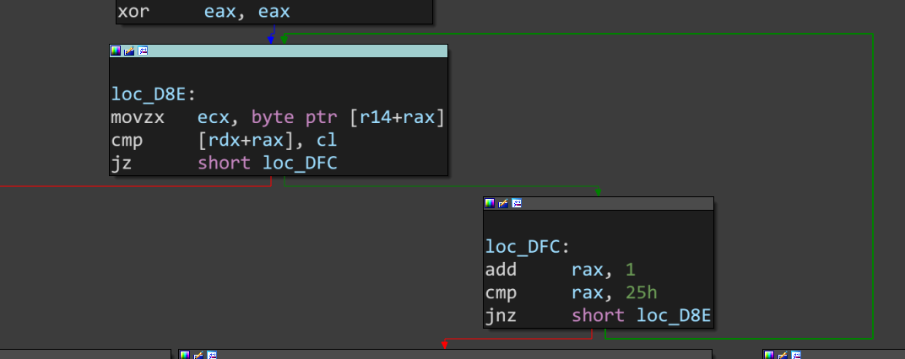

### unic

找到`main`函数，发现第一次输入



`fd`即寄存器`rdi`的值为0，调用`read`从标准输入读取4个字节到`buf`中，接下来一个循环处理多余字符，然后把所有的字符转成小写，进行第一个判断



从上面图1中可以看到，`lea     rbp, [rsp+68h+buf]`这一句将`rbp`指向的值改为了`buf`的地址，之后`rbp`没再改变过，之后`buf`的地址被移进了`rdi`中，所以`sub_2090`调用的第一个参数就是我们的输入，（如果有）第二个参数就是`rsi`指向的`s1`，`sub_2090`函数内部的实现很复杂，先跳过去，后面进行了比较，分析寄存器可以得到参数调用的顺序，`strncmp(s1,s2,0x10)`，将`s1`和`s2`的前16个字节进行对比，应该是相等才能继续调用，然后观察`s2`的值和`sub_2090`的具体实现可以猜测这个函数对我们的输入进行了`md5`加密，然后传给了`s1`，因为输入只有4位，且不区分大小写，所以爆破起来非常快



注意这里是小端序，`s2`要逆序，直接秒出`31d1`

通过之后提示输入`flag`，然后又对之前的输入`31d1`进行了一个处理



对`buf`的每一位进行判断是不是在`0-9`之间，如果是，就减去`'0'`，如果不是，就减去`'W'`，可以做一下试验，这里其实是获取16进制`abcdef`对应的10进制的值，这个`'W'`的值实际上是`'a'-10`得到的，所以这段处理实际上就是把输入的四个字符转成两个十六进制数，即`\x31\xd1`，下面就是调用`unicorn`进行模拟，也没有用其它架构~~比如`mips`~~，`x86`32位指令，为了降低难度，只使用`unicorn`模拟了一个指令，所有的加密过程都使用这一个指令



其中`0x16`对应的寄存器是`ecx`，`0x18`对应的寄存器是`edx`，然后把我们之前的输入作为指令进行模拟，可以通过很多种方式知道这个指令是什么意思



然后发现只是两个数组进行了简单的异或，只需要注意其中一个已知的数组的索引是`+4`，每一个数据后面都跟着3位混淆的数据

接下来国际惯例进行验证



很简单，通过`unicorn`模拟执行出来的数据直接和已知数据逐位比较，全部相同就通过，输入的就是flag，所以通过异或可以直接解得输入的flag，这些值赋值的时候有些麻烦，干脆直接调试就可以找到了

~~用长到不想看的代码实现异或~~

```python
r_ecx = [233, 155, 168, 9, 182, 159, 91, 143, 89, 90, 39, 137, 30, 35, 239, 92, 139, 34, 23, 237, 40, 220, 79, 3, 163,
         87, 56, 158, 168, 89, 143, 80, 91, 95, 106, 14, 27, 181, 97, 2, 112, 200, 183, 85, 174, 138, 46, 182, 60, 17,
         250, 116, 129, 25, 223, 104, 4, 101, 58, 115, 118, 193, 156, 125, 35, 70, 100, 69, 226, 248, 49, 254, 111, 248,
         186, 219, 249, 95, 151, 24, 232, 131, 106, 195, 120, 188, 113, 156, 52, 5, 64, 215, 130, 66, 105, 239, 65, 190,
         18, 166, 91, 134, 10, 16, 175, 150, 63, 108, 133, 229, 18, 242, 45, 83, 141, 69, 222, 234, 70, 249, 188, 221,
         208, 207, 214, 77, 255, 214, 133, 228, 95, 12, 135, 78, 63, 97, 138, 244, 193, 140, 53, 37, 146, 3, 33, 139,
         197, 164]
r_edx = [143, 218, 56, 121, 240, 93, 205, 153, 56, 43, 2, 224, 99, 200, 49, 41, 83, 210, 24, 156, 154, 79, 65, 238, 30,
         27, 193, 225, 114, 139, 207, 179, 178, 242, 187, 20, 92]
flag = ''
for i in range(len(r_edx)):
    flag += chr(r_ecx[4 * i] ^ r_edx[i])
print(flag)
```

直接输出flag：

```
flag{un1c0rN_I5_p0wer7ul_@nd_Use7u1!}
```

